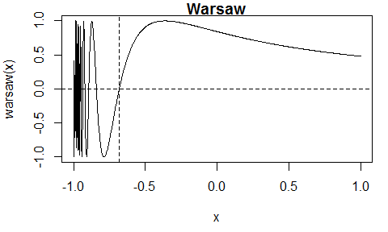

<!-- README.md is generated from README.Rmd. Please edit that file -->

# itp

[](https://ci.appveyor.com/project/paulnorthrop/itp)
[](https://github.com/paulnorthrop/itp/actions/workflows/R-CMD-check.yaml)
[](https://app.codecov.io/github/paulnorthrop/itp?branch=main)
[](https://cran.r-project.org/package=itp)
[](https://cran.r-project.org/package=itp)
[](https://cran.r-project.org/package=itp)

## The Interpolate, Truncate, Project (ITP) Root-Finding Algorithm

The **itp** package implements the Interpolate, Truncate, Project (ITP)
root-finding algorithm of [Oliveira and Takahashi
(2021)](https://doi.org/10.1145/3423597). Each iteration of the
algorithm results in a bracketing interval for the root that is narrower
than the previous interval. It’s performance compares favourably with
existing methods on both well-behaved functions and ill-behaved
functions while retaining the worst-case reliability of the bisection
method. For details see the authors’ [Kudos
summary](https://www.growkudos.com/publications/10.1145%25252F3423597/reader)
and the Wikipedia article [ITP
method](https://en.wikipedia.org/wiki/ITP_method).

### Examples

We use three examples from Section 3 of [Oliveira and Takahashi
(2021)](https://doi.org/10.1145/3423597) to illustrate the use of the
`itp` function. Each of these functions has a root in the interval
$(-1, 1)$. The function can be supplied either as an R function or as an
external pointer to a C++ function.

``` r
library(itp)
```

#### A continuous function

The Lambert function $l(x) = xe^x - 1$ is continuous.


The `itp` function finds an estimate of the root, that is, $x^*$ for
which $f(x^*)$ is (approximately) equal to 0. The algorithm continues
until the length of the interval that brackets the root is smaller than
$2 \epsilon$, where $\epsilon$ is a user-supplied tolerance. The default
is $\epsilon = 10^{-10}$.

First, we supply an R function that evaluates the Lambert function.

``` r
# Lambert, using an R function
lambert <- function(x) x * exp(x) - 1
itp(lambert, c(-1, 1))
#> function: lambert 
#>       root     f(root)  iterations  
#>     0.5671   2.048e-12           8
```

Now, we create an external pointer to a C++ function that has been
provided in the `itp` package and pass this pointer to the function
`itp()`. For more information see the [Overview of the itp
package](https://paulnorthrop.github.io/itp/articles/itp-vignette.html)
vignette.

``` r
# Lambert, using an external pointer to a C++ function
lambert_ptr <- xptr_create("lambert")
itp(lambert_ptr, c(-1, 1))
#> function: lambert_ptr 
#>       root     f(root)  iterations  
#>     0.5671   2.048e-12           8
```

#### The function `itp_c`

Also provided is the function `itp_c`, which is equivalent to `itp`, but
the calculations are performed entirely using C++, and the arguments
differ slightly: `itp_c` has a named required argument `pars` rather
than `...` and it does not have the arguments `interval`, `f.a` or
`f.b`.

``` r
# Calling itp_c()
res <- itp_c(lambert_ptr, pars = list(), a = -1, b = 1)
res
#> function:  
#>       root     f(root)  iterations  
#>     0.5671   2.048e-12           8
```

#### A discontinuous function

The staircase function $s(x) = \lceil 10 x - 1 \rceil + 1/2$ is
discontinuous.


The `itp` function finds the discontinuity at $x = 0$ at which the sign
of the function changes. The value of 0.5 returned for the root
`res$root` is the midpoint of the bracketing interval `[res$a, res$b]`
at convergence.

``` r
# Staircase
staircase <- function(x) ceiling(10 * x - 1) + 1 / 2
res <- itp(staircase, c(-1, 1))
print(res, all = TRUE)
#> function: staircase 
#>       root     f(root)  iterations           a           b         f.a  
#>  7.404e-11         0.5          31           0   1.481e-10        -0.5  
#>        f.b   precision  
#>        0.5   7.404e-11
```

#### A function with multiple roots

The Warsaw function
$w(x) = I(x > -1)\left(1 + \sin\left(\frac{1}{1+x}\right)\right)-1$ has
multiple roots.



When the initial interval is $[-1, 1]$ the `itp` function finds the root
$x \approx -0.6817$. There are other roots that could be found from a
different initial interval.

``` r
# Warsaw
warsaw <- function(x) ifelse(x > -1, sin(1 / (x + 1)), -1)
itp(warsaw, c(-1, 1))
#> function: warsaw 
#>       root     f(root)  iterations  
#>    -0.6817  -5.472e-11          11
```

### Installation

To get the current released version from CRAN:

``` r
install.packages("itp")
```

### Vignette

See the [Overview of the itp
package](https://paulnorthrop.github.io/itp/articles/itp-vignette.html)
vignette, which can also be accessed using
`vignette("itp-vignette", package = "itp")`.
